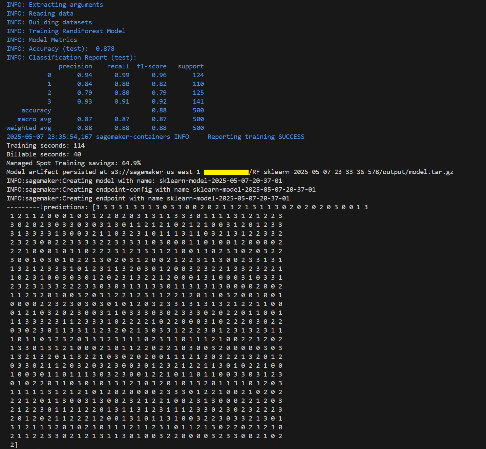

# Mobile Price Classification with Amazon SageMaker & scikit-learn

Predicting mobile phone price ranges using machine learning and cloud-based infrastructure.

---

## Overview

This project presents a comprehensive machine learning pipeline designed to classify mobile phones into distinct price ranges based on their specifications. Utilizing the power of Amazon SageMaker and the versatility of scikit-learn, the workflow encompasses data preprocessing, model training, deployment, and inference, all orchestrated within a scalable and efficient environment.




---

## Features

- **Data Ingestion & Preprocessing**: Efficient loading and preprocessing of CSV data using pandas.
- **Model Training**: Seamless integration with SageMaker's SKLearn estimator for model training.
- **Model Deployment**: Automated deployment of the trained model as a SageMaker endpoint for real-time inference.
- **Inference**: Batch prediction on unseen data to evaluate model performance.
- **Resource Management**: Automated deletion of SageMaker endpoints to manage resources effectively.

---

## Project Structure

    .
    ├── data/
    │ ├── raw/
    │ │ ├── train.csv
    │ │ └── test.csv
    │ └── split/
    │ ├── train.csv
    │ └── test.csv
    ├── script.py
    ├── main.py  # notebook
    ├── .env
    └── README.md


---

## Getting Started

### Prerequisites

- Python 3.12 or higher
- AWS Account with SageMaker and S3 permissions
- AWS CLI configured with appropriate credentials
- AWS S3 bucket

### Installation

1. **Clone the Repository**:

```bash
git clone https://github.com/maikereis/aws-mobile-price-classification.git
cd mobile-price-classification
```

2. **Create and Activate Virtual Environment:**:
```bash
uv python 3.12
uv venv
uv sync
```

3. **Configure Environment Variables:**:

Create a .env file in the root directory and populate it with your AWS configurations:

.env:
```
    AWS_ACCESS_KEY_ID=your_access_key
    AWS_SECRET_ACCESS_KEY=your_secret_key
    AWS_DEFAULT_REGION=your_region
    AWS_S3_BUCKET_NAME=your_s3_bucket_name
    AWS_SAGEMAKER_ROLE=your_sagemaker_execution_role
    AWS_SAGEMAKER_INSTANCE_TYPE=ml.m4.xlarge
```

## Data Processing

* Load the training data from data/raw/train.csv.
* Separate features and target variable (price_range).
* Split the data into training and testing sets (75% train, 25% test).
* Save the splits to data/split/train.csv and data/split/test.csv.
* Upload the split datasets to Amazon S3 under the specified data_prefix.

## Model Training

Training
Utilize SageMaker's SKLearn estimator with the following configurations:

* `entry_point`: script.py
* `instance_type`: ml.m5.large
* `framework_version`: 1.2-1
* `hyperparameters`:
    * `n_estimators`: 100
    * `random_state`: 0

Train the model using the uploaded training and testing datasets.

## Deployment

Deployment
* Deploy the trained model as a SageMaker endpoint.
* Use the endpoint for real-time predictions on new data.

## Inference

* Load unseen test data from local folder `data/raw/test.csv`.
* Use the deployed SageMaker endpoint to predict the price range for the test data.
* Evaluate and analyze the predictions as needed.

## Cleanup

After inference, delete the SageMaker endpoint to avoid incurring unnecessary charges:
 
```python
sm.delete_endpoint(EndpointName=endpoint_name)
```


